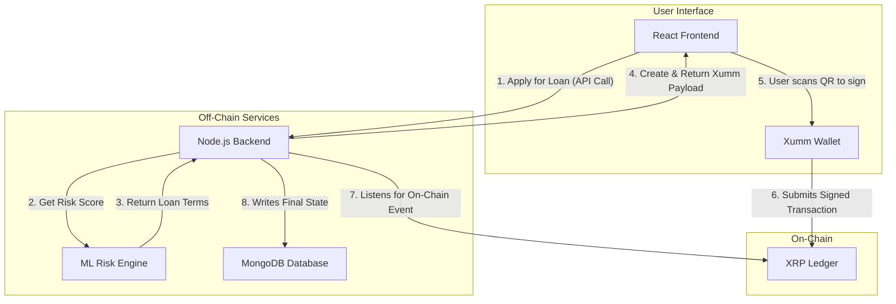

# XRPLend++

**A next-generation DeFi protocol that leverages off-chain machine learning to enable capital-efficient, undercollateralized lending on the XRP Ledger.**

---

[](https://opensource.org/licenses/MIT)
[](https://github.com/siyasiyasiya/xrpl-lending-platform)
[](https://xrpl.org/)

This project is a submission for the XRPL Student Builder Residency. It demonstrates a complete, end-to-end decentralized application with a robust backend, a reactive frontend, and a deep, meaningful integration with the XRP Ledger's core features.

### The Problem with DeFi Lending Today

Standard DeFi lending is capital-inefficient. It requires users to lock up more capital than they can borrow (over-collateralization). This is because current protocols are "trustless" and cannot differentiate between good and bad borrowers, limiting market growth and excluding millions of potential users.

### Our Solution: The Intelligent Lending Protocol

This project solves this problem by introducing a novel, off-chain **Machine Learning Risk Engine** that works in perfect synergy with the XRPL.

The ML model analyzes a user's on-chain history to generate a dynamic credit score. This score then informs the terms of the loan, allowing our protocol to offer more favorable rates—and for the first time, **undercollateralized loans**—to trustworthy participants. I use the XRPL as the **source of truth for our data** and the **secure settlement layer for our contracts**, creating a hybrid system that is more intelligent, inclusive, and capital-efficient than anything on the market today.

## Key Features

*   **ML-Powered Risk Assessment:** Generates a credit score based on on-chain activity to determine loan terms.
*   **Undercollateralized Lending:** Eligible users can borrow more than their locked collateral.
*   **On-Chain Escrow:** Utilizes XRPL's native `EscrowCreate` functionality to secure user collateral in a trustless manner.
*   **End-to-End dApp Experience:** A full-stack application with user authentication, a loan dashboard, and a guided signing process.
*   **Seamless Xumm Wallet Integration:** Securely handles all transaction signing on both desktop and mobile.
*   **Automated Loan Lifecycle Management:** From `PENDING` to `ACTIVE` to `REPAID` or `DEFAULTED`, the entire loan lifecycle is managed by the protocol.
*   **Robust Default Handling:** A resilient process for handling defaulted loans, including grace periods and on-chain collateral claiming.

## Tech Stack


| Frontend                                                                                                 | Backend                                                                                                | Blockchain & Database                                                                                             |
| -------------------------------------------------------------------------------------------------------- | ------------------------------------------------------------------------------------------------------ | ----------------------------------------------------------------------------------------------------------------- |
|                            |                    |                                      |
|       |                    |                              |
|                                                       |                     |                                                              |
|                                |                                              |                                                                                                                   |

## Architecture: A Hybrid On-Chain & Off-Chain System

This protocol is designed to leverage the best of both worlds: the immutable truth of the blockchain and the computational power of off-chain services.



## Core XRPL Features Utilized

This protocol doesn't just use the XRPL as a simple database; the ledger's unique, native features are the foundation of the security and trust model.

*   **Native On-Chain Escrows:** I used `EscrowCreate` to lock user collateral directly on the ledger. This is a native smart contract that programmatically enforces the terms of the loan without the need for complex, custom-deployed contracts, making our protocol highly secure and efficient.

*   **Atomic On-Ledge Payments:** The core functions of the protocol, disbursing loans and processing repayments, are executed as `Payment` transactions. I use the ledger as the ultimate source of truth by verifying transaction hashes to confirm that value has been transferred before updating our internal state.

*   **On-Chain Data Anchoring (Memos):** Every significant transaction is tagged with on-chain metadata using the `Memos` field. This allows the protocol to link on-chain activity (like a repayment) directly to off-chain records (like a specific `loanId`), making the protocol transparent and auditable.

*   **Fast Transaction Finality (3-5 seconds):** The near-instant finality of the XRPL allows for a superior user experience. Loan disbursements and collateral releases are confirmed almost instantly, removing the uncertainty and long waiting periods common on other platforms.

## Getting Started (Local Development)

Follow these instructions to set up and run the project locally.

### Prerequisites

*   Node.js (v16 or later)
*   npm
*   MongoDB Atlas account (or local MongoDB instance)
*   Xumm Developer API Key and Secret

### 1. Clone the Repository

```bash
git clone https://github.com/siyasiyasiya/xrpl-lending-platform.git
cd xrpl-lending-platform
```

### 2. Backend Setup

```bash
# Navigate to the backend directory
cd backend

# Install dependencies
npm install

# Create an environment file
cp .env.example .env
```

Now, open the .env file and fill in your credentials:

```
# .env file for backend
PORT=5000
MONGO_URI=your_mongodb_connection_string
JWT_SECRET=your_strong_jwt_secret
XUMM_API_KEY=your_xumm_api_key
XUMM_API_SECRET=your_xumm_api_secret
PLATFORM_ESCROW_ADDRESS=your_protocol's_funded_xrpl_address
PLATFORM_ESCROW_SECRET=your_protocol's_xrpl_account_secret
RIPPLE_NODE=wss://s.altnet.rippletest.net:51233
DEFAULT_GRACE_PERIOD_DAYS=3
```

### 3. Frontend Setup

```bash
# Navigate to the frontend directory from the root
cd frontend

# Install dependencies
npm install

# Create an environment file
cp .env.example .env
```

Open the new .env file and add your backend URL:

```
# .env file for frontend
REACT_APP_API_URL=http://localhost:5000/api
```
